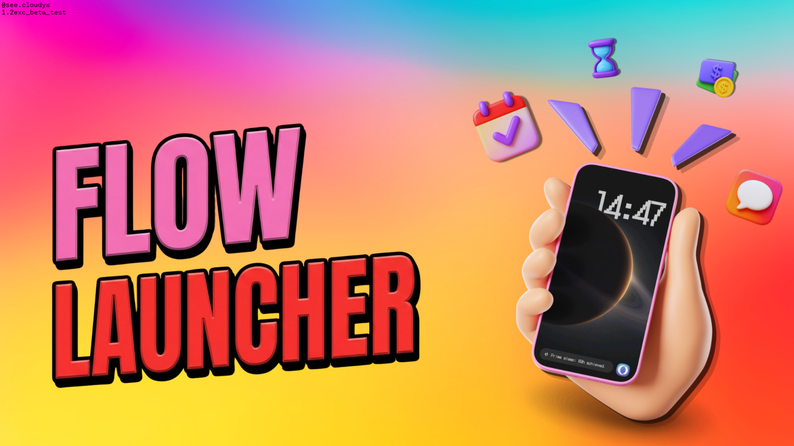

 

# Minimal Flow Launcher - **BETA**

*A home screen built around clarity.*
 
*Inspired by the quiet elegance of OneUI and Origin OS.*
 

 

---

<table>
  <tr>
    <td align="center" width="340" bgcolor="#0f1f2e">
       
      🌤️ 
      <b><code>01</code> Smart Pill Bar</b>  
      A single adaptive bar that surfaces what matters. Weather in the morning, calendar at noon, focus timers during work, and wind-down prompts at night. No clutter. No guessing.
        
    </td>
    <td align="center" width="340" bgcolor="#1a0f2e">
       
      🔥 
      <b><code>02</code> Habit Heatmap</b>  
      Track your streaks with a contribution heatmap right on the home screen. Mark habits done directly from the Pill Bar. No app switching, no friction.
        
    </td>
  </tr>
  <tr>
    <td align="center" width="340" bgcolor="#1a2e0f">
       
      💰 
      <b><code>03</code> Money Manager</b>  
      Income and expense widgets that appear only when relevant. Financial clarity without ever leaving your home screen.
        
    </td>
    <td align="center" width="340" bgcolor="#2e1a0f">
       
      🗂️ 
      <b><code>04</code> Adaptive App Drawer</b>  
      List mode for speed. Grid mode for beauty. Dynamic search finds any app instantly, exactly as your mind expects.
        
    </td>
  </tr>
  <tr>
    <td align="center" width="340" bgcolor="#2e1a2e">
       
      🎨 
      <b><code>05</code> Thematic Color Palettes</b>  
      Fully dynamic, aesthetic-driven color tokens. Personalize the entire launcher interface with beautifully crafted palettes to perfectly match your vibe.
        
    </td>
    <td align="center" width="340" bgcolor="#1a2e2e">
       
      ⚡ 
      <b><code>06</code> Fluid & Efficient</b>  
      Built with a highly optimized core. Low memory footprint, smooth animations, and entirely free of distractions or ads.
        
    </td>
  </tr>
</table>

---

### ✦ Design

🔡 `Dot-Matrix Typography` &nbsp;·&nbsp; ⬛ `True OLED Black` &nbsp;·&nbsp; ✦ `Essential Iconography`

*Every element earns its place or disappears.*

---

### 🤝 Contribute

<pre>
01  Fork the repository 🍴
02  git checkout -b feature/your-idea
03  git commit -m 'Add something beautiful ✨'
04  Push and open a Pull Request 🚀
</pre>

---

 *"Simplicity is the ultimate sophistication."* ✦ Leonardo da Vinci
  
  

  <i>© 2026 See.Cloudys Team — All rights reserved</i> 
  Private Launcher Experience • Not for redistribution • Internal Use Only

